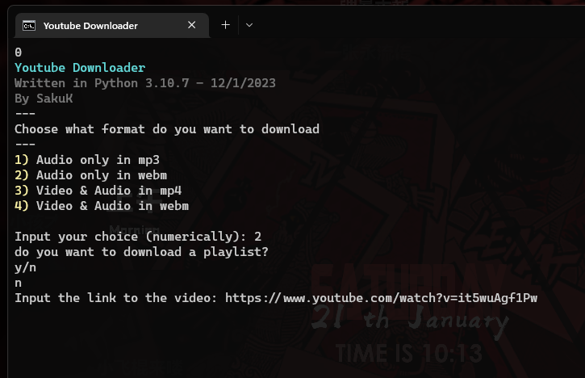

# **YouTube Video Downloader - Version 0.9**


This is a Python-based tool for downloading YouTube videos or playlists directly to your computer. It uses the powerful [yt-dlp](https://github.com/yt-dlp/yt-dlp) library and integrates with [FFmpeg](https://www.ffmpeg.org/) for seamless audio and video processing.

## **Features**
- **Password Protection**: Ensures only authorized users can access the program.
- **Customizable Formats**: Download options include:
  - Audio only (MP3 or WebM)
  - Video and Audio (MP4 or WebM)
- **Playlist Support**: Download entire playlists with ease.
- **Fast and Reliable**: Built to avoid slow or unreliable online downloaders.
- **Interactive Terminal Interface**: Provides video details before downloading.

## **Dependencies**
To use this tool, the following dependencies are required:
- [yt-dlp](https://github.com/yt-dlp/yt-dlp) - A modern fork of youtube-dl.
- [FFmpeg](https://www.ffmpeg.org/) - Converts downloaded videos and audio into user-selected formats.

Install dependencies with:
```bash
pip install yt-dlp
```

## **How to Use**
1. Clone this repository to your local machine.
2. Ensure you have [Python](https://www.python.org/) and the required dependencies installed.
3. Run the script and follow the terminal instructions to:
   - Input the password for access.
   - Choose your preferred format and input the video or playlist URL.
   - Let the tool do the rest!

## **Notes**
- The tool downloads files directly to your Desktop for easy access.
- If you'd like, assign a custom icon (included in the `images` folder) to the script for quick identification.

## **Preview**
Below is a glimpse of the downloader's terminal interface:



---

Feel free to contribute or report any issues to help improve this project!
